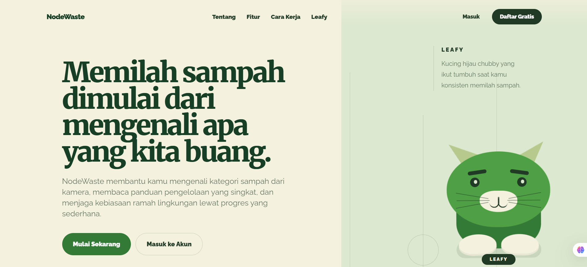

<section id="usage">
  <h2>Cara Penggunaan Scan Aplikasi</h2>

  

    <h3>1. Masuk ke web aplikasi berikut: https://nodewaste.vercel.app/ </h3>
    

      
    

  

  

    <h3>2. Buat akun baru atau masuk ke akun yang telah ada</h3>
    

      Buat akun baru bagi pengguna baru atau masuk ke akun yang telah dibuat
    

      

        
      

  

  

    <h3>3. Masuk ke halaman scan scan</h3>
    

      Buka kamera dari halaman scan, arahkan ke sampah yang ingin dikenali, lalu gunakan hasilnya sebagai titik awal edukasi pengelolaan.
    

        

          
        

  

  

    <h3>4. Baca kategori dan panduan pengelolaan.</h3>
    

      Hasil scan menampilkan kategori, akurasi, dan langkah sederhana agar user tahu apakah sampah perlu dipilah, dibersihkan, atau dibawa ke fasilitas khusus.
    

        

          
        

  

  

    <h3>5. Kumpulkan EcoPoints dan rawat Leafy.</h3>
    

      Scan valid memberi progress. EcoPoints bisa dipakai untuk merawat Leafy, sementara XP dan streak menjaga motivasi tetap terlihat dari waktu ke waktu.
    

  

</section>
